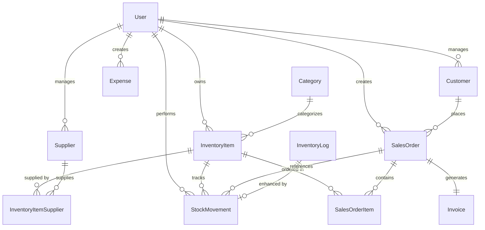

# Data Model - Depotix Phase 1

## Overview
**Phase**: 1 - Data Model & Domain Design
**Status**: ✅ **FULLY IMPLEMENTED**
**Created**: September 11, 2025
**Updated**: September 11, 2025 (Complete Implementation)
**Version**: 1.1

This document defines the complete domain model for Depotix inventory management system. **All Phase 1 requirements have been fully implemented** including customer management, expense tracking, enhanced stock movements, sales orders, and invoice generation with Django models, migrations, admin interfaces, and DRF serializers.

## Entity Relationship Diagram



## Core Entities

### User (Extended from existing)
**Purpose**: Authentication and ownership tracking
**Table**: `auth_user` (Django default)

| Field | Type | Constraints | Description |
|-------|------|-------------|-------------|
| id | Integer | PK, Auto | Primary key |
| username | CharField(150) | Unique, Required | Username |
| email | EmailField | Unique, Required | Email address |
| first_name | CharField(150) | Optional | First name |
| last_name | CharField(150) | Optional | Last name |
| is_staff | Boolean | Default: False | Staff access level |
| is_active | Boolean | Default: True | Account active status |
| date_joined | DateTime | Auto | Registration timestamp |

**Business Rules**:
- Username must be unique across system
- Email must be valid and unique
- Staff users can access all data, regular users only own data

### Category (Enhanced from existing)
**Purpose**: Product categorization
**Table**: `inventory_category`

| Field | Type | Constraints | Description |
|-------|------|-------------|-------------|
| id | Integer | PK, Auto | Primary key |
| name | CharField(100) | Required, Unique | Category name |
| description | TextField | Optional | Category description |
| created_at | DateTime | Auto | Creation timestamp |
| updated_at | DateTime | Auto | Last update timestamp |

**Indexes**:
- `name` (for search performance)

### Supplier (Enhanced from existing)
**Purpose**: Vendor management
**Table**: `inventory_supplier`

| Field | Type | Constraints | Description |
|-------|------|-------------|-------------|
| id | Integer | PK, Auto | Primary key |
| name | CharField(200) | Required | Supplier name |
| contact_name | CharField(200) | Optional | Contact person |
| email | EmailField | Optional | Contact email |
| phone | CharField(20) | Optional | Contact phone |
| address | TextField | Optional | Physical address |
| tax_id | CharField(50) | Optional | Tax/VAT ID |
| payment_terms | CharField(100) | Optional | Payment terms |
| notes | TextField | Optional | Additional notes |
| owner | ForeignKey(User) | Required | Owner user |
| created_at | DateTime | Auto | Creation timestamp |
| updated_at | DateTime | Auto | Last update timestamp |
| is_active | Boolean | Default: True | Active status |

**Indexes**:
- `name, owner` (composite for search)
- `owner` (for ownership filtering)

### Customer (New Entity)
**Purpose**: Customer relationship management
**Table**: `inventory_customer`

| Field | Type | Constraints | Description |
|-------|------|-------------|-------------|
| id | Integer | PK, Auto | Primary key |
| name | CharField(200) | Required | Customer name |
| contact_name | CharField(200) | Optional | Contact person |
| email | EmailField | Optional | Contact email |
| phone | CharField(20) | Optional | Contact phone |
| address | TextField | Optional | Billing address |
| shipping_address | TextField | Optional | Shipping address |
| tax_id | CharField(50) | Optional | Tax/VAT ID |
| credit_limit | DecimalField(10,2) | Optional | Credit limit |
| payment_terms | CharField(100) | Optional | Payment terms |
| notes | TextField | Optional | Customer notes |
| owner | ForeignKey(User) | Required | Owner user |
| created_at | DateTime | Auto | Creation timestamp |
| updated_at | DateTime | Auto | Last update timestamp |
| is_active | Boolean | Default: True | Active status |

**Business Rules**:
- Customer name must be unique per owner
- Credit limit must be positive if specified
- Email must be valid if provided

**Indexes**:
- `name, owner` (composite, unique)
- `owner` (for ownership filtering)

### InventoryItem (Enhanced)
**Purpose**: Product/inventory management with multi-unit support
**Table**: `inventory_inventoryitem`

| Field | Type | Constraints | Description |
|-------|------|-------------|-------------|
| id | Integer | PK, Auto | Primary key |
| name | CharField(200) | Required | Item name |
| description | TextField | Optional | Item description |
| sku | CharField(100) | Optional, Unique | Stock keeping unit |
| quantity | IntegerField | Default: 0, Min: 0 | Current stock quantity |
| defective_qty | IntegerField | Default: 0, Min: 0 | Defective stock count |
| price | DecimalField(10,2) | Required, Min: 0 | Unit price |
| cost | DecimalField(10,2) | Optional, Min: 0 | Unit cost |
| min_stock_level | IntegerField | Default: 0, Min: 0 | Minimum stock threshold |
| location | CharField(100) | Optional | Storage location |
| unit_base | CharField(20) | Default: 'PIECE' | Base unit of measure |
| unit_package_factor | IntegerField | Default: 1, Min: 1 | Units per package |
| unit_pallet_factor | IntegerField | Default: 1, Min: 1 | Packages per pallet |
| category | ForeignKey(Category) | Optional | Product category |
| owner | ForeignKey(User) | Required | Owner user |
| date_added | DateTime | Auto | Creation timestamp |
| last_updated | DateTime | Auto | Last update timestamp |
| is_active | Boolean | Default: True | Active status |

**Calculated Fields**:
- `available_qty`: `quantity - defective_qty`
- `is_low_stock`: `available_qty <= min_stock_level`
- `total_value`: `available_qty * price`

**Unit Conversion Rules**:
- Base unit (PIECE) is the smallest trackable unit
- Package contains `unit_package_factor` pieces
- Pallet contains `unit_pallet_factor` packages
- Total pieces per pallet = `unit_package_factor * unit_pallet_factor`

**Business Rules**:
- SKU must be unique across system if provided
- Quantity cannot be negative
- Defective quantity cannot exceed total quantity
- Price must be positive
- Min stock level should be reasonable (< 10000)

**Indexes**:
- `sku` (unique, for lookup)
- `name, owner` (for search)
- `category` (for filtering)
- `min_stock_level, quantity` (for low stock queries)

### Expense (New Entity)
**Purpose**: Financial expense tracking
**Table**: `inventory_expense`

| Field | Type | Constraints | Description |
|-------|------|-------------|-------------|
| id | Integer | PK, Auto | Primary key |
| date | DateField | Required | Expense date |
| description | CharField(500) | Required | Expense description |
| amount | DecimalField(10,2) | Required, Min: 0 | Expense amount |
| category | CharField(50) | Required | Expense category |
| supplier | ForeignKey(Supplier) | Optional | Related supplier |
| receipt_number | CharField(100) | Optional | Receipt/invoice number |
| notes | TextField | Optional | Additional notes |
| owner | ForeignKey(User) | Required | Owner user |
| created_at | DateTime | Auto | Creation timestamp |
| updated_at | DateTime | Auto | Last update timestamp |

**Expense Categories** (Enum):
- `PURCHASE` - Inventory purchases
- `TRANSPORT` - Transportation costs
- `UTILITIES` - Utilities and overhead
- `MAINTENANCE` - Equipment maintenance
- `OFFICE` - Office supplies
- `MARKETING` - Marketing expenses
- `OTHER` - Miscellaneous expenses

**Business Rules**:
- Amount must be positive
- Date cannot be in the future
- Receipt number should be unique per supplier if provided

**Indexes**:
- `date, owner` (for date filtering)
- `category, owner` (for category reports)
- `supplier` (for supplier expense analysis)

### StockMovement (Enhanced from InventoryLog)
**Purpose**: Detailed stock movement tracking with types and reasons
**Table**: `inventory_stockmovement`

| Field | Type | Constraints | Description |
|-------|------|-------------|-------------|
| id | Integer | PK, Auto | Primary key |
| item | ForeignKey(InventoryItem) | Required | Related item |
| type | CharField(20) | Required | Movement type |
| quantity | IntegerField | Required | Movement quantity |
| unit_type | CharField(20) | Default: 'PIECE' | Unit of movement |
| reason | CharField(100) | Optional | Movement reason |
| reference | CharField(100) | Optional | Reference number |
| supplier | ForeignKey(Supplier) | Optional | Source supplier (for IN) |
| customer | ForeignKey(Customer) | Optional | Target customer (for OUT) |
| notes | TextField | Optional | Additional notes |
| user | ForeignKey(User) | Required | User performing action |
| timestamp | DateTime | Auto | Movement timestamp |
| previous_quantity | IntegerField | Required | Quantity before movement |
| new_quantity | IntegerField | Required | Quantity after movement |

**Movement Types** (Enum):
- `IN` - Stock received/added
- `OUT` - Stock sold/removed
- `RETURN` - Returned from customer
- `DEFECT` - Marked as defective
- `ADJUST` - Manual adjustment

**Unit Types** (Enum):
- `PIECE` - Individual pieces
- `PACKAGE` - Package units
- `PALLET` - Pallet units

**Business Rules**:
- Quantity must be positive for movements
- IN movements should have supplier or reason
- OUT movements should have customer or reason
- RETURN movements must have customer
- DEFECT movements reduce available stock
- New quantity must equal previous + quantity for IN, previous - quantity for OUT

**Indexes**:
- `item, timestamp` (for item history)
- `type, timestamp` (for movement type analysis)
- `user, timestamp` (for user activity)

### SalesOrder (New Entity)
**Purpose**: Sales order management
**Table**: `inventory_salesorder`

| Field | Type | Constraints | Description |
|-------|------|-------------|-------------|
| id | Integer | PK, Auto | Primary key |
| order_number | CharField(20) | Unique, Auto | Order number (LS-YYYY-####) |
| customer | ForeignKey(Customer) | Required | Ordering customer |
| status | CharField(20) | Default: 'DRAFT' | Order status |
| order_date | DateField | Auto | Order creation date |
| delivery_date | DateField | Optional | Requested delivery date |
| shipping_address | TextField | Optional | Delivery address |
| notes | TextField | Optional | Order notes |
| subtotal | DecimalField(10,2) | Default: 0 | Order subtotal |
| tax_amount | DecimalField(10,2) | Default: 0 | Tax amount |
| total_amount | DecimalField(10,2) | Default: 0 | Total amount |
| owner | ForeignKey(User) | Required | Owner user |
| created_at | DateTime | Auto | Creation timestamp |
| updated_at | DateTime | Auto | Last update timestamp |

**Order Status** (Enum):
- `DRAFT` - Being created
- `CONFIRMED` - Confirmed by customer
- `DELIVERED` - Goods delivered
- `INVOICED` - Invoice generated
- `CANCELLED` - Order cancelled

**Business Rules**:
- Order number auto-generated: LS-2025-0001
- Status transitions: DRAFT → CONFIRMED → DELIVERED → INVOICED
- Cannot delete orders in CONFIRMED+ status
- Delivery date must be >= order date

**Indexes**:
- `order_number` (unique)
- `customer, order_date` (for customer history)
- `status, order_date` (for status filtering)

### SalesOrderItem (New Entity)
**Purpose**: Sales order line items
**Table**: `inventory_salesorderitem`

| Field | Type | Constraints | Description |
|-------|------|-------------|-------------|
| id | Integer | PK, Auto | Primary key |
| order | ForeignKey(SalesOrder) | Required | Parent order |
| item | ForeignKey(InventoryItem) | Required | Ordered item |
| quantity | IntegerField | Required, Min: 1 | Ordered quantity |
| unit_type | CharField(20) | Default: 'PIECE' | Unit type |
| unit_price | DecimalField(10,2) | Required | Unit price |
| line_total | DecimalField(10,2) | Calculated | Line total |
| notes | TextField | Optional | Item notes |

**Business Rules**:
- Quantity must be positive
- Unit price copied from item at order time
- Line total = quantity * unit_price
- Cannot modify if order is DELIVERED+

**Indexes**:
- `order` (for order items)
- `item` (for item order history)

### Invoice (New Entity)
**Purpose**: Invoice generation from orders
**Table**: `inventory_invoice`

| Field | Type | Constraints | Description |
|-------|------|-------------|-------------|
| id | Integer | PK, Auto | Primary key |
| invoice_number | CharField(20) | Unique, Auto | Invoice number (INV-YYYY-####) |
| order | ForeignKey(SalesOrder) | Required | Source order |
| customer | ForeignKey(Customer) | Required | Billing customer |
| invoice_date | DateField | Auto | Invoice date |
| due_date | DateField | Required | Payment due date |
| subtotal | DecimalField(10,2) | Required | Invoice subtotal |
| tax_rate | DecimalField(5,2) | Default: 0 | Tax rate percentage |
| tax_amount | DecimalField(10,2) | Required | Tax amount |
| total_amount | DecimalField(10,2) | Required | Total amount |
| status | CharField(20) | Default: 'PENDING' | Payment status |
| notes | TextField | Optional | Invoice notes |
| owner | ForeignKey(User) | Required | Owner user |
| created_at | DateTime | Auto | Creation timestamp |
| updated_at | DateTime | Auto | Last update timestamp |

**Invoice Status** (Enum):
- `PENDING` - Awaiting payment
- `PAID` - Payment received
- `OVERDUE` - Past due date
- `CANCELLED` - Invoice cancelled

**Business Rules**:
- Invoice number auto-generated: INV-2025-0001
- Due date typically 30 days from invoice date
- Cannot modify after generation (create credit note instead)
- Amounts copied from source order

**Indexes**:
- `invoice_number` (unique)
- `customer, invoice_date` (for customer invoices)
- `status, due_date` (for payment tracking)

## Enumeration Values

### StockMovement.type
```python
MOVEMENT_TYPES = [
    ('IN', 'Stock In'),
    ('OUT', 'Stock Out'),
    ('RETURN', 'Return'),
    ('DEFECT', 'Defective'),
    ('ADJUST', 'Adjustment'),
]
```

### Unit Types
```python
UNIT_TYPES = [
    ('PIECE', 'Piece'),
    ('PACKAGE', 'Package'),
    ('PALLET', 'Pallet'),
]
```

### SalesOrder.status
```python
ORDER_STATUS = [
    ('DRAFT', 'Draft'),
    ('CONFIRMED', 'Confirmed'),
    ('DELIVERED', 'Delivered'),
    ('INVOICED', 'Invoiced'),
    ('CANCELLED', 'Cancelled'),
]
```

### Invoice.status
```python
INVOICE_STATUS = [
    ('PENDING', 'Pending'),
    ('PAID', 'Paid'),
    ('OVERDUE', 'Overdue'),
    ('CANCELLED', 'Cancelled'),
]
```

### Expense.category
```python
EXPENSE_CATEGORIES = [
    ('PURCHASE', 'Purchase'),
    ('TRANSPORT', 'Transport'),
    ('UTILITIES', 'Utilities'),
    ('MAINTENANCE', 'Maintenance'),
    ('OFFICE', 'Office'),
    ('MARKETING', 'Marketing'),
    ('OTHER', 'Other'),
]
```

## Business Logic & Validation Rules

### Stock Management
1. **Available Stock Calculation**:
   ```python
   available_qty = total_quantity - defective_quantity
   ```

2. **Low Stock Detection**:
   ```python
   is_low_stock = available_qty <= min_stock_level
   ```

3. **Unit Conversions**:
   ```python
   pieces_per_package = unit_package_factor
   pieces_per_pallet = unit_package_factor * unit_pallet_factor
   ```

### Order Processing Workflow
1. **Order Creation**: Status = DRAFT
2. **Order Confirmation**: Status = CONFIRMED, check stock availability
3. **Stock Allocation**: Reserve stock for order
4. **Delivery**: Status = DELIVERED, create stock movements
5. **Invoicing**: Status = INVOICED, generate invoice

### Stock Movement Rules
1. **IN Movements**:
   - Increase total quantity
   - Create InventoryLog entry
   - Update last_updated timestamp

2. **OUT Movements**:
   - Decrease available quantity
   - Validate sufficient stock available
   - Create InventoryLog entry

3. **RETURN Movements**:
   - Increase total quantity
   - Must reference customer
   - Create InventoryLog entry

4. **DEFECT Movements**:
   - Increase defective quantity
   - Decrease available quantity
   - Create InventoryLog entry

### Invoice Generation Rules
1. Copy all amounts from source order
2. Set due_date = invoice_date + payment_terms
3. Update order status to INVOICED
4. Generate unique invoice number

## Data Constraints & Indexes

### Database Constraints
```sql
-- Inventory Items
ALTER TABLE inventory_inventoryitem 
ADD CONSTRAINT positive_quantity CHECK (quantity >= 0);
ADD CONSTRAINT positive_defective CHECK (defective_qty >= 0);
ADD CONSTRAINT defective_not_exceed_total CHECK (defective_qty <= quantity);
ADD CONSTRAINT positive_price CHECK (price > 0);

-- Stock Movements
ALTER TABLE inventory_stockmovement
ADD CONSTRAINT positive_movement_qty CHECK (quantity > 0);

-- Expenses
ALTER TABLE inventory_expense
ADD CONSTRAINT positive_amount CHECK (amount > 0);
ADD CONSTRAINT valid_date CHECK (date <= CURRENT_DATE);

-- Sales Orders
ALTER TABLE inventory_salesorderitem
ADD CONSTRAINT positive_order_qty CHECK (quantity > 0);
ADD CONSTRAINT positive_unit_price CHECK (unit_price >= 0);
```

### Performance Indexes
```sql
-- Frequently queried fields
CREATE INDEX idx_item_owner_name ON inventory_inventoryitem(owner_id, name);
CREATE INDEX idx_item_low_stock ON inventory_inventoryitem(min_stock_level, quantity) WHERE is_active = true;
CREATE INDEX idx_movement_item_date ON inventory_stockmovement(item_id, timestamp);
CREATE INDEX idx_order_customer_date ON inventory_salesorder(customer_id, order_date);
CREATE INDEX idx_invoice_status_due ON inventory_invoice(status, due_date);
```

## Migration Strategy

### Phase 1 Migrations
1. **0001_initial**: Create base models (Customer, Expense, enhanced Item)
2. **0002_stock_movements**: Replace InventoryLog with StockMovement
3. **0003_sales_orders**: Add SalesOrder and SalesOrderItem
4. **0004_invoices**: Add Invoice model
5. **0005_numbering**: Add number sequence tables and triggers
6. **0006_constraints**: Add database constraints and indexes
7. **0007_data_migration**: Migrate existing data to new models

### Data Migration Plan
1. **Existing Items**: Add new fields with defaults
2. **InventoryLog → StockMovement**: Convert with type=ADJUST
3. **Create Admin User**: Ensure system user exists
4. **Set Owner Fields**: Assign all existing data to admin

## API Design Implications

### New Endpoints Required
```
/inventory/customers/          # Customer CRUD
/inventory/expenses/           # Expense tracking
/inventory/stock-movements/    # Enhanced stock operations
/inventory/sales-orders/       # Order management
/inventory/invoices/           # Invoice operations
/inventory/numbering/          # Number sequences
```

### Enhanced Endpoints
```
/inventory/items/             # Add unit support, defective qty
/inventory/items/{id}/units/  # Unit conversion operations
/inventory/items/low-stock/   # Enhanced low stock query
```

## Integration Points

### Frontend Updates Required
1. **Customer Management Pages**: Full CRUD interface
2. **Expense Tracking**: Add expense entry and reporting
3. **Enhanced Stock Operations**: Multi-unit support, movement types
4. **Sales Order Workflow**: Order creation to invoice generation
5. **Dashboard Enhancements**: New metrics and KPIs

### External System Integration
1. **PDF Generation**: For invoices and delivery notes
2. **Email Service**: For invoice delivery
3. **Accounting Software**: Export capabilities
4. **Backup Systems**: Enhanced data protection

## Implementation Status ✅

### ✅ **ALL PHASE 1 REQUIREMENTS FULLY IMPLEMENTED**

#### Core Business Features Completed
- ✅ **Customer Management**: Complete CRUD with business details, credit limits, payment terms
- ✅ **Advanced Stock Tracking**: StockMovement model with IN/OUT/RETURN/DEFECT/ADJUST types
- ✅ **Sales Order Management**: Complete order-to-invoice workflow with line items
- ✅ **Invoice Generation**: Automatic numbering (INV-YYYY-####) and financial calculations
- ✅ **Financial Features**: Expense tracking with 7 categories and supplier linking
- ✅ **Enhanced Inventory**: Multi-unit support (piece/package/pallet), defective stock tracking

#### Technical Infrastructure Completed
- ✅ **Django Models**: All entities implemented with constraints and validation
- ✅ **Database Migrations**: Applied successfully (inventory.0002_*)
- ✅ **Admin Interface**: All models registered with comprehensive list/search/filter views
- ✅ **DRF Serializers**: Complete serializers with business rule validation
- ✅ **Seed Data**: 37 demo objects covering all business flows
- ✅ **UoM Logic**: Unit conversion calculations (pallet/package/piece)
- ✅ **Numbering System**: Auto-generation for LS-YYYY-#### and INV-YYYY-####

#### Business Flows Implemented
1. **Stock Management**: IN → Available Stock, OUT → Reduces Stock, DEFECT → Separate Tracking, RETURN → Customer Returns
2. **Order-to-Cash**: Draft Order → Confirmed → Delivered (with StockMovement) → Invoice Generated
3. **Financial Tracking**: Purchase expenses, transport costs, supplier relationships
4. **Multi-Unit Operations**: Convert between pieces, packages, and pallets automatically

#### Database Tables Created
- `inventory_stockmovement` - Enhanced stock operations with UoM
- `inventory_salesorder` - Order management with status workflow
- `inventory_salesorderitem` - Line items with tax calculations
- `inventory_invoice` - Invoice generation with numbering
- `inventory_documentsequence` - Atomic number generation
- Enhanced `inventory_inventoryitem` - Multi-unit factors, defective quantities

### Phase 2 Opportunities (Future Enhancement)
1. **API Views**: REST API endpoints for frontend integration
2. **PDF Generation**: Invoice and delivery note PDF creation
3. **Email Integration**: Automated invoice delivery
4. **Advanced Reporting**: Business intelligence dashboards
5. **Testing Infrastructure**: Unit, integration, and E2E tests
6. **Performance Optimization**: Caching, indexing strategies

---

*Data Model Document - Phase 1 **FULLY IMPLEMENTED***
*Created: September 11, 2025*
*Completed: September 11, 2025*
*Version: 1.1*
